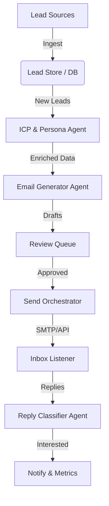

# AI GTM Agent

**AI GTM Agent** is an autonomous Go-To-Market system designed to automate and optimize the outbound sales lifecycle. It leverages agentic workflows to handle lead ingestion, deep research, personalized email drafting, and intelligent reply classification—all while keeping a human in the loop for final approval.

👉 **[View Integration Roadmap](docs/INTEGRATIONS.md)**

## ✨ Key Highlights

- **🤖 Autonomous Research**: The `ICPPersonaAgent` analyzes prospect companies and products to determine fit and key talking points.
- **✉️ Hyper-Personalization**: The `EmailGeneratorAgent` crafts unique, relevant emails based on research data.
- **🛡 Enterprise-Grade Risk Control**: Built-in daily **Send Caps**, **Throttling** (delay between sends), and **Idempotency** checks to prevent spam flags.
- **👮 Human-in-the-Loop**: A dedicated **Admin UI** (served via FastAPI) allows Ops teams to batch-review, edit, and approve drafts.
- **🔬 Full Observability**: Complete event lifecycle logging (`INGEST` -> `GEN` -> `APPROVE` -> `SEND`) for audit trails.
- **📥 Smart Inbox Management**: `ReplyClassifierAgent` automatically categorizes replies and stops follow-ups for interested/unsubscribed leads.

## 🚀 Quick Start (The "Magic Moment")

We have included a pilot onboarding script to demonstrate the full agent capability in 30 seconds.

1.  **Start the Backend Server**:
    ```bash
    python3 -m backend.api.server
    ```

2.  **Run the Pilot Demo** (in a new terminal):
    ```bash
    python3 scripts/pilot_onboarding.py
    ```
    *Follow the interactive prompts to define your ICP, generate test leads, and launch your first AI campaign.*

3.  **Visit the Dashboard**:
    Open [http://localhost:8000](http://localhost:8000) to verify the metrics and logs.

## 🏗 Architecture

The system follows a modular, event-driven architecture organized into specialized agents and services.



## 📂 Project Structure

```
/
├── backend/
│   ├── agents/            # Intelligent Agents (Research, Drafting, Classification)
│   ├── api/               # FastAPI Server & Endpoints
│   ├── core/              # Config, LLM Client (OpenAI/Mock)
│   ├── services/          # Business Logic (Ingest, Sender, Risk Control)
│   └── storage/           # SQLite DB & Models
├── frontend/              # Admin Dashboard (served statically by backend)
├── scripts/               # Demo & Utility Scripts
└── docs/                  # Documentation
```

## ⚙️ Configuration & Installation

1.  **Install Dependencies**:
    ```bash
    pip install -r requirements.txt
    ```

2.  **Environment Setup**:
    Create a `.env` file to enable real AI features (optional, defaults to Mock mode).
    ```bash
    OPENAI_API_KEY=sk-...  # Required for real content generation
    SLACK_WEBHOOK_URL=...  # Required for Slack notifications
    MOCK_LLM=False         # Set to True to save costs during dev
    ```

3.  **Run Manually**:
    If you prefer not to use the pilot script:
    ```bash
    # Start Server
    python3 -m backend.api.server

    # Visit UI
    # http://localhost:8000
    ```

## 🛠 Tech Stack

- **Backend**: Python 3.9+, FastAPI, SQLite
- **AI/LLM**: OpenAI GPT-4o (or interchangeable provider via `LLMClient`)
- **Frontend**: Vanilla JS/CSS (Lightweight, Dark Mode)
- **Deployment**: Ready for Docker/Cloud Run (Stateless API + Persistent DB volume)
