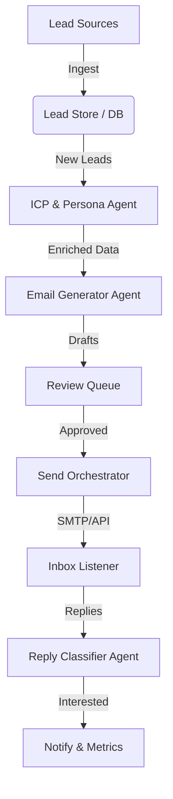

# AI GTM Agent

**AI GTM Agent** is an autonomous Go-To-Market system designed to automate and optimize the outbound sales lifecycle. It leverages agentic workflows to handle lead ingestion, deep research, personalized email drafting, and intelligent reply classification—all while keeping a human in the loop for final approval.

## 🏗 Architecture

The system follows a modular, event-driven architecture organized into specialized agents and services.



### ASCII View
```text
                 ┌───────────────────────────┐
                 │   Admin / Ops UI (Web)     │
                 │ ICP配置 / Review / Metrics │
                 └─────────────┬─────────────┘
                               │
                               v
┌───────────────┐     ┌───────────────────┐     ┌─────────────────────┐
│ Lead Sources  │ --> │ Lead Ingest &      │ --> │ Lead Store          │
│ (Apollo/LI)   │     │ Dedup/Clean        │     │ (Postgres/SQLite)   │
└───────────────┘     └───────────────────┘     └─────────────────────┘
                               │
                               v
                     ┌───────────────────┐
                     │ Enrichment Layer  │
                     │ (optional)        │
                     └─────────┬─────────┘
                               │
                               v
                     ┌───────────────────┐
                     │ ICP/Persona Agent │
                     │ (Company + Product│
                     │  Summary -> Schema│
                     └─────────┬─────────┘
                               │
                               v
                     ┌───────────────────┐
                     │ Email Generator   │
                     │ (Prompt+Constraints│
                     │  + Templates)     │
                     └─────────┬─────────┘
                               │
                               v
                     ┌───────────────────┐
                     │ Review Queue      │
                     │ (Human-in-loop)   │
                     └─────────┬─────────┘
                               │ approve
                               v
                     ┌───────────────────┐
                     │ Send Orchestrator │
                     │ (state machine)   │
                     └─────────┬─────────┘
                               │ SMTP/Gmail
                               v
                     ┌───────────────────┐
                     │ Inbox Listener    │
                     │ (Gmail API)       │
                     └─────────┬─────────┘
                               │
                               v
                     ┌───────────────────┐
                     │ Reply Classifier  │
                     │ (LLM classifier)  │
                     └─────────┬─────────┘
                               │
                               v
                     ┌───────────────────┐
                     │ Notify + Metrics  │
                     │ (Slack/Email + UI)│
                     └───────────────────┘
```

## ✨ Key Features

- **🤖 Autonomous Research**: The `ICPPersonaAgent` analyzes prospect companies and products to determine fit and key talking points.
- **✉️ Hyper-Personalization**: The `EmailGeneratorAgent` crafts unique, relevant emails based on research data, not generic templates.
- **🛡 Human-in-the-Loop**: A dedicated **Admin UI** allows GTM operations to review, edit, and approve drafts before they are sent.
- **📥 Smart Inbox Management**: `ReplyClassifierAgent` automatically categorizes replies (e.g., "Interested", "Not Interested", "OOO") and triggers alerts for hot leads.
- **📊 Analytics**: Tracks the full lifecycle of a lead from ingestion to conversation.

## 📂 Project Structure

The project is split into a Python-based backend (Agents & Services) and a lightweight Frontend (Dashboard).

```
/
├── backend/
│   ├── agents/            # Intelligent Agents (LLM Workers)
│   │   ├── icp_persona/   # Research & Profiling
│   │   ├── email_gen/     # Content Generation
│   │   └── reply_cls/     # Sentiment/Intent Classification
│   ├── services/          # Infrastructure Services
│   │   ├── lead_ingest/   # Data pipeline
│   │   ├── sender/        # Sending Logic (State Machine)
│   │   ├── listener/      # Email Polling
│   │   └── notify/        # Slack/Alerts
│   ├── storage/           # Database Layer (SQLite)
│   └── main.py            # Simulation Runner
├── frontend/              # Ops Dashboard
│   ├── index.html         # Main UI
│   ├── style.css          # Dark Mode Premium Styles
│   └── app.js             # Logic
└── README.md
```

## 🚀 Getting Started

### Prerequisites

- Python 3.8+
- Use a modern browser for the Frontend.

### Installation

1.  **Clone the repository**:
    ```bash
    git clone https://github.com/yourusername/AI_GTM_Agent.git
    cd AI_GTM_Agent
    ```

2.  **Install Dependencies**:
    ```bash
    pip install -r requirements.txt
    ```

3.  **Verify Environment**:
    Create a `.env` file (optional) to configure API keys:
    ```
    OPENAI_API_KEY=sk-...
    MOCK_LLM=True
    ```

### Usage

#### 1. Start the API Server
The backend now exposes a REST API powered by FastAPI.
```bash
python3 -m backend.api.server
```
*Server will start at `http://localhost:8000`*

#### 2. Launch the Admin Dashboard
Open `frontend/index.html` in your browser. It is configured to talk to `localhost:8000`.

#### 3. Test Ingestion (Optional)
You can use `curl` to manually ingest a lead while the server running:
```bash
curl -X POST "http://localhost:8000/leads" \
     -H "Content-Type: application/json" \
     -d '{"name": "John Doe", "company": "Acme Inc", "email": "john@acme.com"}'
```

## 🛠 Tech Stack

- **Backend**: Python, SQLite
- **Agents**: Designed for LLM integration (OpenAI/Anthropic/DeepSeek placeholder logic implemented).
- **Frontend**: HTML5, CSS3 (Modern Variables, Flexbox/Grid), Vanilla JavaScript.
